# Hell Let Loose (HLL) discord utilities


CRCON is mainly designed and developed for PC gamers. For example, it is not possible for console players to use a keyboard to enter data in the chat window. This tool framework is mainly aimed at console players.

<a href="https://discord.gg/wrtb">
  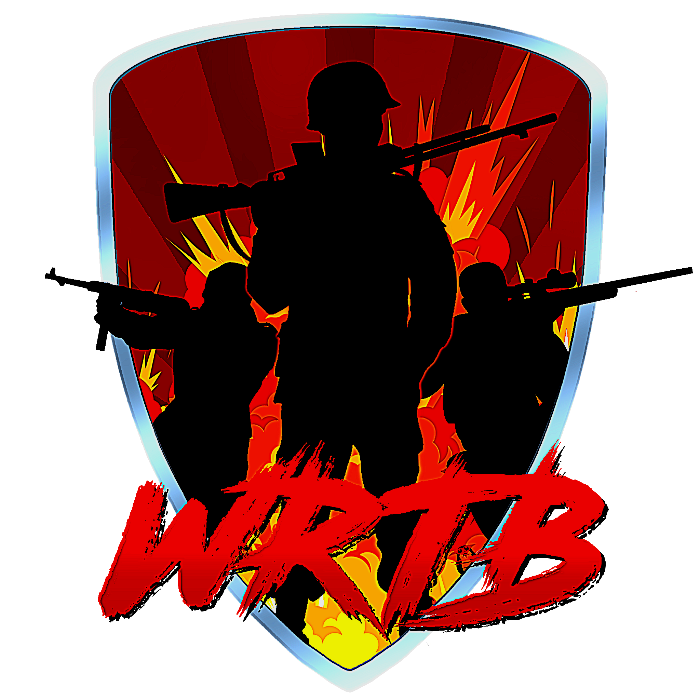
</a>

Connect with us on Discord for feedback, troubleshooting, and update information: https://discord.gg/wrtb

[](https://ko-fi.com/gryhon)
## Content

- [Features](#features)
  - [Map Vote](#vote-map)
  - [Adaptive Level Cap](#adaptive-level-cap)
  - [Server Balance](#server-balance)
  - [Server Status](#server-status)
  - [Map Rotation](#map-rotation)
  - [Comfort Functions](#comfort-functions)

- [Installation](#installation)
  - [Limitation](#1-limitaion)
  - [Precondition](#2-precondition)
  - [Get hll_dicord_utils](#3-get-the-hll_discord_utils-from-github)
  - [Config file](#4-edit-the-config-file)
  - [Start Docker container](#5-start-the-docker-contaner)
  - [Update the repository](#6-update-the-the-repository)
  - [Useful commands](#7-useful-commands)


## Features

All of the following features are stand-alone and can be used individually. If you only want to use one of the functions or only a subset, this is possible via the configuration.

- [Map Vote](#vote-map)
- [Adaptive Level Cap](#adaptive-level-cap)
- [Server Balance](#server-balance)
- [Server Status](#server-status)
- [Map Rotation](#map-rotation)
- [Comfort Functions](#comfort-functions)


### Vote Map

The main reason for developing this tool set is to provide the map vote function for console players. 

- A random selection of maps will be created and made available as a poll in a Discord channel.
- The random generator can be controlled within limits.
  - You can determine which type of cards should be played (e.g. warfare, control, offensive).
  - You can determine how many day or night maps should be offered
  - You can create a blacklist of maps that should not be offered under any circumstances.
  - You can determine how many maps from a certain pool should always be offered. This is particularly interesting if there is a new map that you would like to play more often.
  - It is also possible to select a number of maps from a wildcard list. (e.g. control or offensive). These are offered in addition to the previously selected cards.
  - It is configurable from what number of players, the vote is available and when with how many players it is deactivated. This hysteresis avoids toggling the vote function.
- As a player, you can register so that you do not receive any further reminders in the game after the election.
  - The interval at which a reminder is sent to the players can be set.
- There is also a Dry Run function that allows you to try out the function without involving all players in the game.
- The intermediate vote result is presented as a message in the game
- If you need or want to restart the docker container, it has no effect on the existing choice. When the container is restarted, the existing choice is evaluated and used.
- You can pause and resume the election with a discord command. This could be usefull, if you are prepare a clan ware and you would like to pause the vote function during the cw.

#### Example:

<div style="display: flex; justify-content: space-around; align-items: center;">
  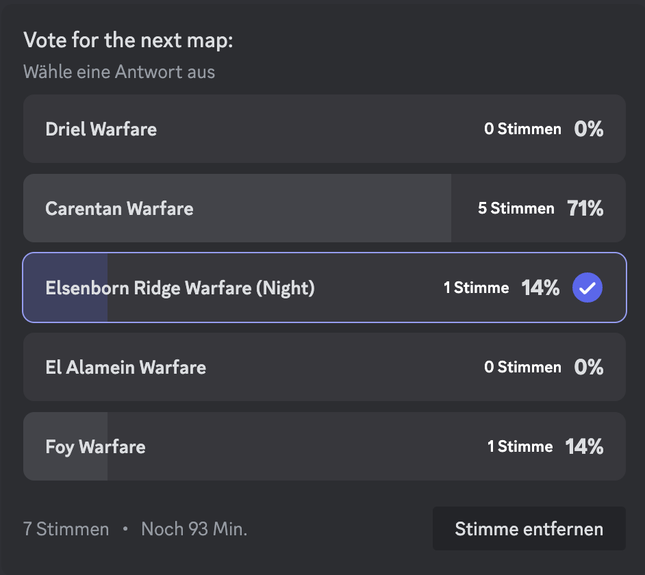
  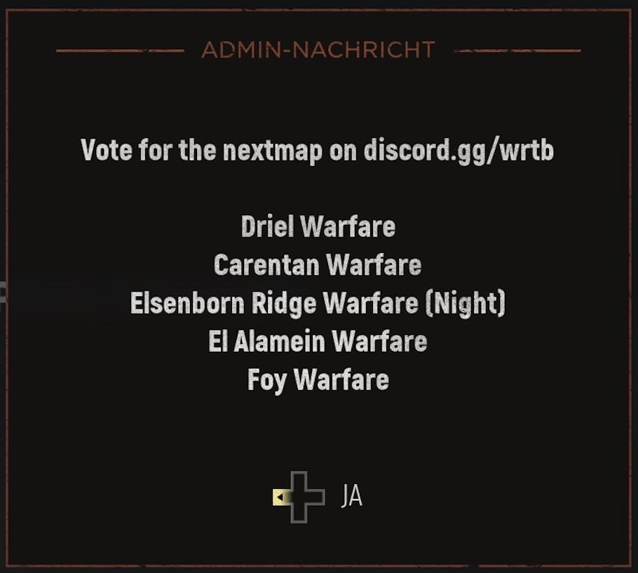
  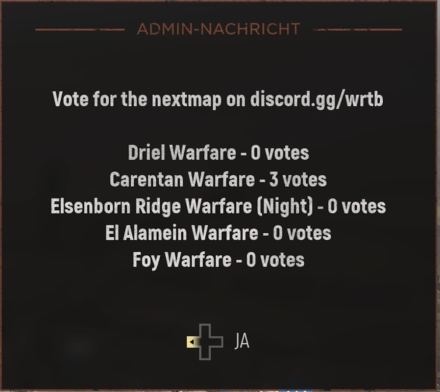
</div>

<div style="text-align: left; margin-left: 15px; margin-top: 50px">
  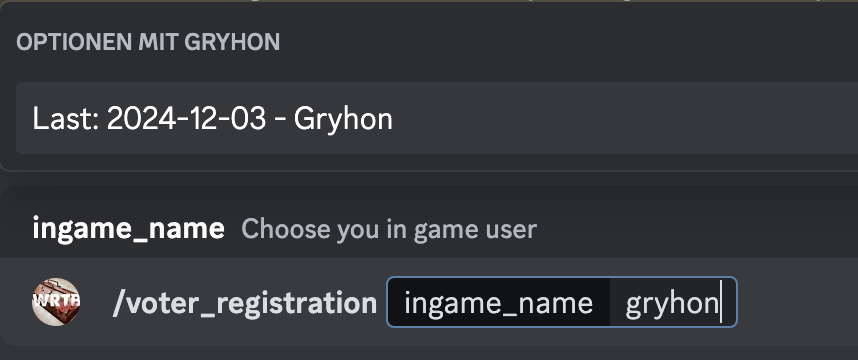
</div>

[Jump to the top](#features)


### Adaptive Level Cap

I have noticed that on some servers simply kick players after seeding because they are below a certain level. I didn't like this behavior, so I developed the adaptive level cap.

- After reaching a certain number of players, new players below a certain level are no longer allowed to join the server.
- Players who are already on the server before this limit is reached remain untouched and can continue to play.
- Players with VIP status are allowed on the server regardless of their level.
- Players who have the level 1 bug can access the server.

### Server Balance
- Display of the balance of both sides.
  - Comparison of the players score in relation to level cluster
  - Level clusters are configurable
  - A level cluster receives a certain combat value, which is included in a higher-level balance calculation.

#### Example:
<div style="text-align: left; margin-left: 50px">
  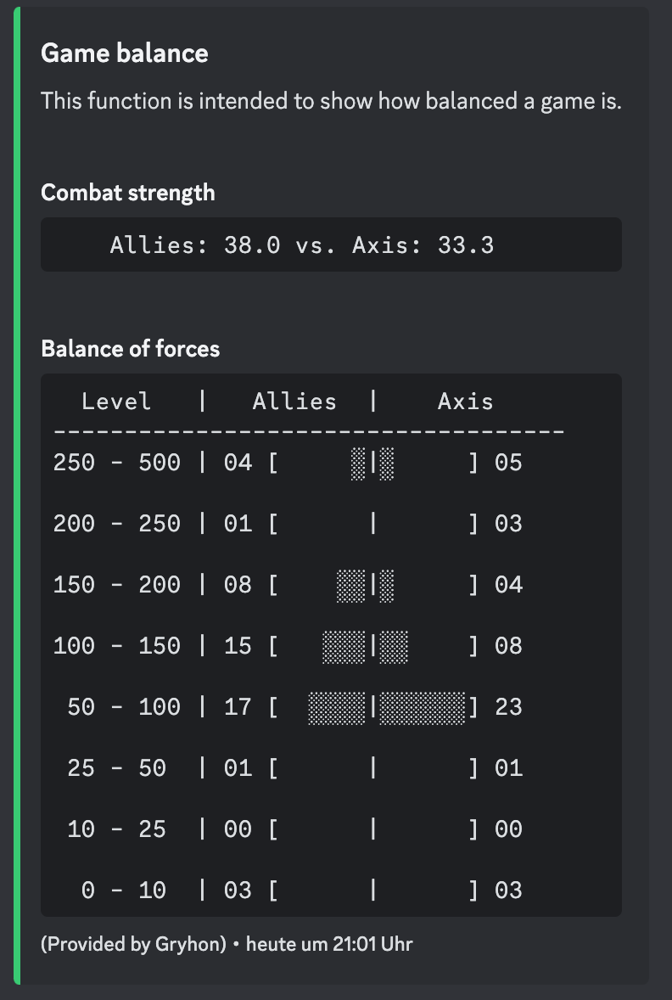
</div>

[Jump to the top](#features)

### Server Status
- Display of the current map
- Display of the next map
- Amount of player on both sides
- Total amount of player
- Time Remaining
- Sector control

#### Example:
<div style="text-align: left; margin-left: 50px">
  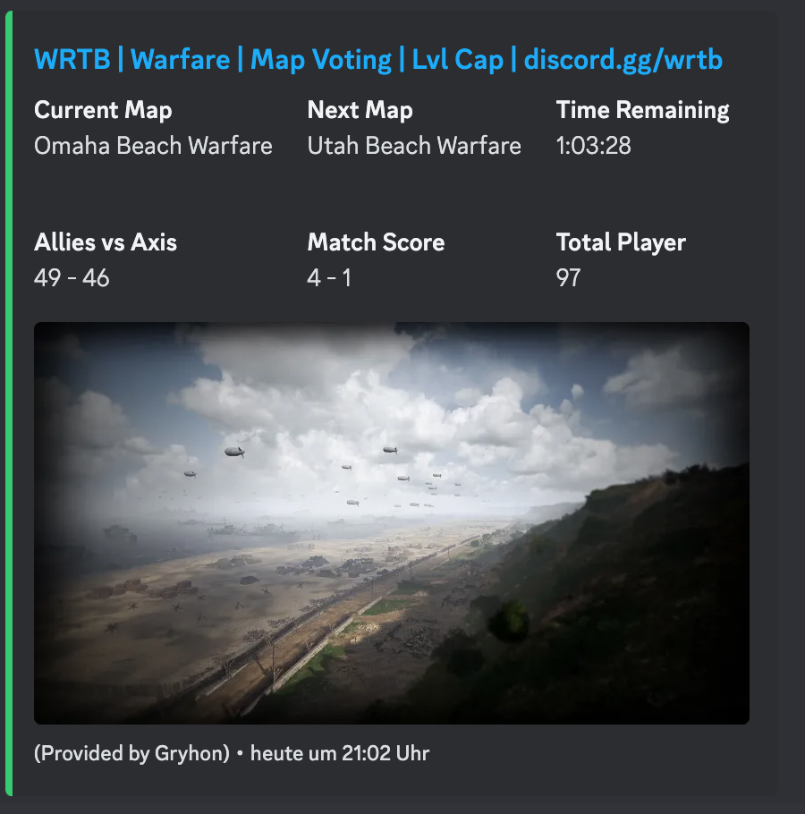
</div>

[Jump to the top](#features)
  
### Map Rotation
- Display of the current map rotation

#### Example:
<div style="text-align: left; margin-left: 50px">
  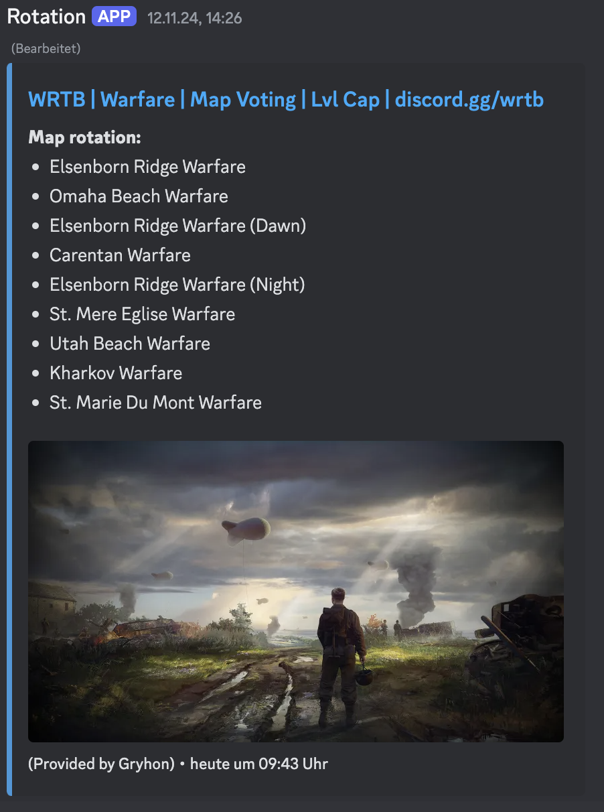
</div>

[Jump to the top](#features)

### Comfort Functions

- I would like to address a message to one fraction or both fractions. The existing function is too cumbersome for me.
  - You can send a broadcast message to one or both fractions with predifined messages like `Please balance the server` or `Server will be closed after this game`.
  - Additionally it is possible to send free text.
- For artillery player I added a mil calculator.

#### Example for broadcast message:
<div style="text-align: left; margin-left: 50px">
  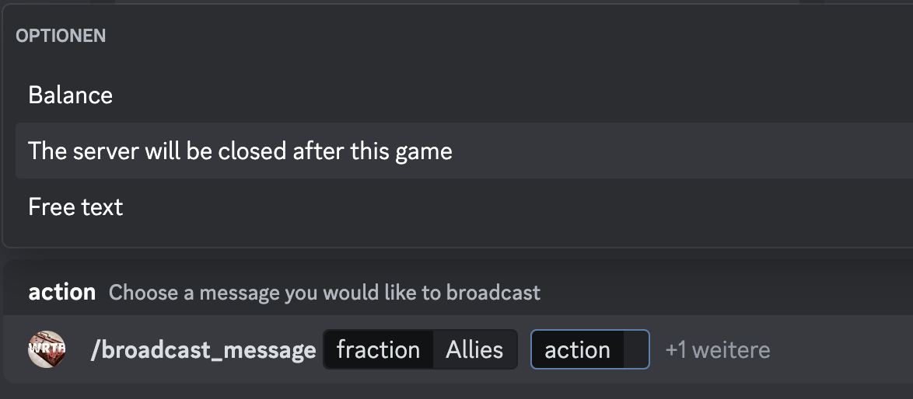
</div>

#### Example for mil calculator:
<div style="display: flex; justify-content: space-around; align-items: center;">
  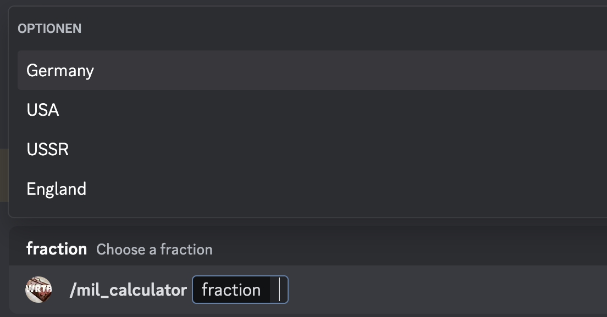
  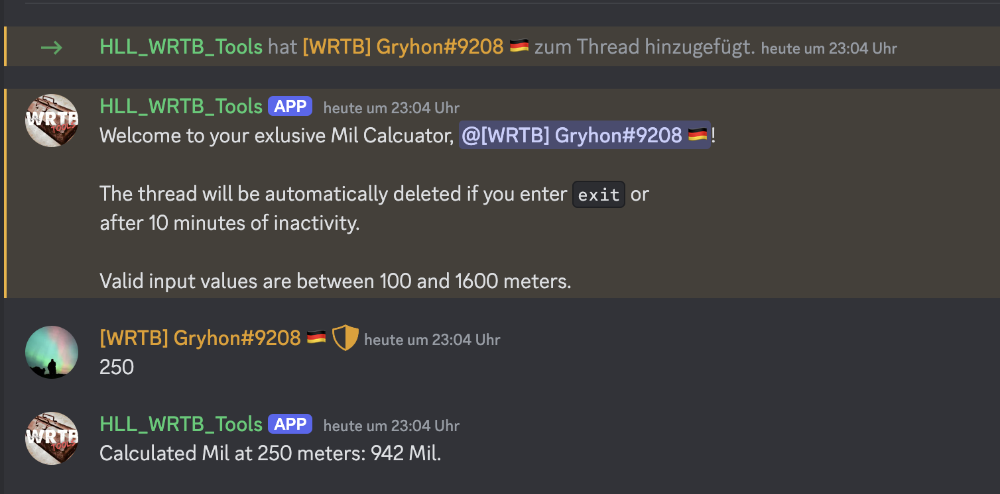
</div>


[Jump to the top](#features)

## Installation

> [!Important]
> Currently there are no means in the bot to limit the access to the discord comands by code. YOU HAVE TO LIMIT THE ACCESS BY ROLES AND RULES!

The software is intended to run in a Docker container. I recommend that you run the Docker container alongside the CRCON server on your VSP.

### 1. Limitaion

> [!Important]
> `hll_discord_utils` is currently supporting only one Server per instance!

[Jump to the top](#content)

### 2. Precondition
- You must have access to a CRCON Server
  - You need a bearer Token to access the API of CRCON Server
  - You need basic knowledge about Linux and Docker
- I assume that you are **not** login as `root` and you have to execute all commands as `sudo`!
- I assume that you are using folder `/opt` as indended for proprietary software.
- I assume that you are aware using editors like `vi`, `vim`, `emacs` or `nano`

> [!TIP]
> I observed exceptions due to unresolved urls by using an external DNS.
> I recommend to insert the IP address of you CRCON into your local `/etc/hosts` file

> [!Important]
> For the adaptive level cap function the software needs to read the current level of the player. <br>
> Unfortunetely the CRCON API cannot handle whitespaces at the end of the user name. <br>
> Therefore it is necessary to add the following regular expressions into your `name kicks`: <br><br>
> `"\\s+$"` and `"[A-Za-z0-9]+\\s+$"` <br><br>
> Otherwise this function will not work as intended!

> [!Important]
> Check the access to the discord commands carefully. 
> Ensure that only the people who are supposed to have access to the Discord commands actually have it! 

- You must register yourself at https://discord.com/developers/docs/intro to get a bot token to run the bot in your discord server
- The discord bot needs the following access on your discord server
  - View Channels
  - Create Private Threads 
  - Create Polls
  - Send Messages
  - Manage Threads
  - Send Messages in Threads
  - Read Message History

[Jump to the top](#content)

### 3. Get the hll_discord_utils from GitHub

Change folder to `opt`:
``` shell
cd /opt
```

Use git to clone the repository:
``` shell
sudo git clone https://github.com/Gryhon/hll_discord_utils.git
```

Get in the newly created folder:
``` shell
cd hll_discord_utils
sudo git checkout <last release>
```
[Jump to the top](#content)

### 4. Edit the config file

Copy template file to `config.json`:
``` shell
sudo cp template.json config.json
```

edit the `config.json`file due to your needs:
``` shell
sudo vi config.json
```

[Jump to the top](#content)

### 4.1 Basic setup

*(Optional but **highly** recommended):*<br>
Create a seperate CRCON user. All messages send by the Bot will be in the audit trial of the corresponding user!

```json
{
    "rcon": [
        {
        "server_number": 1,                 // Currently space holder for multiple server support
        "api_url": "",                      // Base URL to your CRCON server e.g. https://best.clan.ever or http://127.0.0.1:8010
        "stats_url": "",                    // URL to your CRCON status page
        "bearer_token": "",                 // Bearer token (Django API Key) you can create at e.g. https://best.clan.ever/admin
        "discord_token": "",                // Your discord developer token for this bot -> https://discord.com/developers/docs/intro
        "log_level": "INFO",                // I recommend not to change this. 

        "comfort_functions":[{
                "enabled": false,           // enabling the comfort functions (discord commands) You have to ensure that the access is limited!
                "dryrun": false
            }],

        "map_rotation":[{
                "enabled": false,           // enable the display of the current map rotation (if map vote is enabled only the next map will be displayed)
                "webhook": ""               // Webhook URL you want to show your map rotation
            }],

        "server_status": [{
                "enabled": false,           // enable the display of additional information see chapter "Server status"
                "webhook": ""               // Webhook URL you want to show your map rotation
            }],

        "server_balance": [{
                "enabled": false,           // enable the display of the current server balance.
                "level_categories": [10, 25, 50, 100, 150, 200, 250],       // seperate the level into cluster 
                "combat_weights": [0.1, 0.25, 0.25, 0.5, 1, 1, 1, 1.25],    // define the combat weigth for the coresponding cluster. Be aware you need one more item than in the cluster!!
                "webhook": ""               // Webhook URL you want to show your server balance
            }],
        "auto_level":[{
                "enabled": false,           // enable the adaptive level cap
                "dryrun": false,
                "min_level": 50,            // minimum level of the player
                "allow_vips": true,         // allows player with VIP independently of ther level.
                "player_count": 60,         // amount of player on the server when the rule sould be enforced
                "levelbug_enabled": true,   // allow level 1 player on the server. We all hate the lvl 1 bug.
                "kick_message": "Your level is below {min_level} or you don't own a VIP seat. This server has an adaptive level cap."
            }],
        "map_vote": [{
                "enabled": false,           // enables the map vote
                "dryrun": false,
                "activate_vote": 55,         // minimum amount of playwer to activate the map vote function
                "dectivate_vote": 50,        // minimum amount of playeer to deactivate the map vote function
                "vote_channel_id": 0,        // discord channel id where the vote should happens
                "reminder": 20,              // time in minutes to remind the player to vote 
                "vote_header": "Vote for the nextmap on <your discord>", // add here your header for the vote window ingame
                "default_map_filter":[{      // map names and enviroment can be found here https://gist.github.com/timraay/5634d85eab552b5dfafb9fd61273dc52
                                             // ensure that all items are !! lower case !!  
                    "enviroment": [],        // enviroment filter e.g "day"
                    "game_mode": []          // game mode filter e.g "warfare"
                }],
                "map_pool":[{
                    "day": 0,                     // Amount of day maps in the vote
                    "night": 0,                   // Amount of night maps in the vote
                    "wildcard": 0,                // Amount of wildcard maps in the vote
                    "enforce": 0,                 // Amount of enforced maps in the vote.
                                                  // Important, this are not additional maps. They will replace maps from day and night selection! 
                    "battle_mode":[],             // Pool from which the random maps are to be drawn.
                                                  // e.g ["warefare", "control"]
                    "wildcard_mode":[],           // Pool from which the wildcards maps are to be drawn.
                                                  // e.g ["offensive"]
                    "enforced_maps":[],           // Pool of maps that should be used at every map. Normal usage when new maps are available
                                                  // e.g ["elsenbornridge_warfare_day", "elsenbornridge_warfare_night", "elsenbornridge_warfare_morning"]
                    "blacklist_maps":[],          // Pool of maps that should be used at every map. Normal usage when new maps are available
                                                  // e.g ["kursk_warfare_night", "remagen_warfare", "remagen_warfare_night"]
                    "exclude_played_maps": 0      // Number of maps that may not be reused over n votes.
                }]
            }]
    }]
}
```

[Jump to the top](#content)

### 5. Start the docker container

> [!Note]
> To make it easier to track software errors, this log information is not only displayed in the docker console,
> but also written to the folder as a log file. A maximum of seven days is recorded. One log file is created per day.

To run this command you have to be in the coresponding folder
``` shell
sudo docker compose up -d # starts the container as deamon
```

### 6. Update the the repository

Stop the docker container. To run this command you have to be in the coresponding folder
``` shell
sudo docker compose down
```

Get the new software and checkput the current release version
```shell
sudo git pull
sudo git fetch --tags
sudo git checkout <version>
sudo git branch               # verify that you are on the correct branch 
```

``` shell
sudo docker compose up -d # starts the container as deamon
```

[Jump to the top](#content)

### 7. Useful commands

Show log information in docker:
``` shell
sudo docker compose logs -f
```
The following command used to remove unused Docker resources and free up disk space.
- removes all stopped containers
- removes all unused networks
- removes all dangling images
- removes all build caches

``` shell
sudo docker system prune -a
```

Show log information from current log file:
``` shell
sudo tail -n 100 -f <logfile>
```

[Jump to the top](#content)


